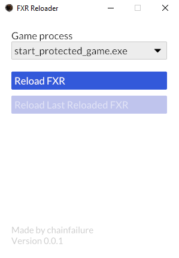

# FXR reloader :boom:

## What is this?
This piece of hot garbage allows you to swap out FXR files without having to repackage
them with yabber or restart the game at all.

## How do I use this?
 - You launch Elden Ring (v1.10.0) or Sekiro (v1.6.0)
 - You launch this tool.
 - You ensure the game's process is set to the right process (only really needs tweaking if you're running multiple
    instances of the game).
 - You edit an FXR by some means
 - You click "Reload FXR"
 - You select one or multiple edited FXR files
 - The FXR **definitions** are now patched (this means the effects need recreating for this to be visible, reapply buffs, 
    recast spells, reload maps to unload map-specific effects, etc)

## Why would I use this?
Repacking and restarting the game gets cumbersome if you're fine-tuning colors and durations.

## What in the name of fatcat is an FXR?
It's a proprietary format developed and used by From Software to define visual effects
for their in-house engine. If you've played a souls game and seen practically anything that in
the area of a visual effect you've seen an FXR definition in action.

## Help! I reloaded an FXR and I don't see a difference!
This tool changes the definition. This definition then gets instanced and put in the world.
In order for a reloaded FXR to show it's difference it has to be recreated. For buffs and spells
you can simply recast the spell or reapply the buff. For more global things like the player light
and map pieces you should be able to force a clean-up and respawn by warping back to the same area.

Another thing to keep in mind is that this tool only replaces the definition if it is in the CSSfxImp already. That
means that editing map-specific FXRs require you to be on that piece of the map. Otherwise, the FXRs associated with the
map are not in memory and therefor cannot be patched.

One last thing: FXR is a lesser understood format, and we can't always directly correlate what
we see on screen to the FXR definition (an FXR definition might specify the same colors 20 times
and the one you've changed is responsible for coloring 2 pixels on the entire FXR, good luck
seeing that). To assert if the issue is with this tooling or the cause lies with the FXR itself,
I suggest you try tweaking and reloading FXR 300 from the common effects. This FXR is responsible
for the player light and any changes to it should be visible after a map reload.

## Show me!

## How does it work?
When you supply one or more FXR definitions for patching it injects `fxr_reloader_agent.dll` into your chosen game.
The agent DLL contains a bunch of spooky code that reads the games memory to find the current FXR definition and
then replaces it with the ones you supplied.

## Hi mom!
Katalash gave me a PoC that he couldn't turn into a full tool because of time constraints. So he's the real goat
responsible for this tool. I merely regurgitate.

### Dependencies:
 - [dll-syringe](https://github.com/OpenByteDev/dll-syringe) per MIT license
 - [iced](https://github.com/iced-rs/iced) per MIT license
